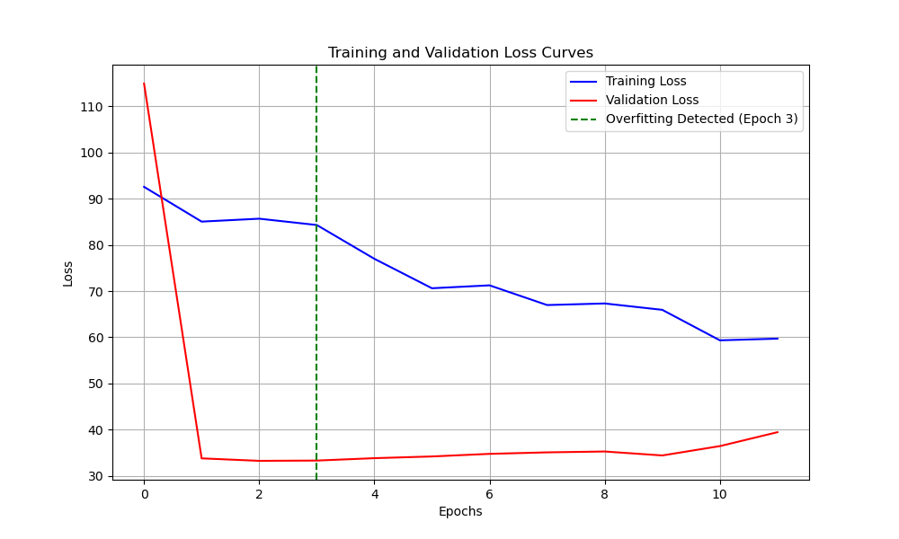

# Audio Classification Model Analysis Report

## 1. Experiment Overview

- **Experiment Name:** audio_fcnn_regression
- **Model Type:** cnn
- **Data Type:** audio
- **Task Type:** regression

## 2. Model Structure Analysis

- **Total Parameters:** 25817857
- **Layer Count:** 0
- **Layers with Most Parameters:**

## 3. Training History Analysis

- **Epochs Trained:** 12
- **Training Time:** 41.4856698513031 seconds
- **Final Training Loss:** 59.69905090332031
- **Final Validation Loss:** 39.443294525146484
- **Best Validation Loss:** 33.244327545166016
- **Convergence Speed:** 4.974893297467913 (average loss decrease per epoch)
- **Train-Validation Difference:** 35.977635065714516 (average difference)
- **Convergence Status:** Underfitting (Training loss higher than validation loss)
- **Overfitting Detected:** Yes (Epoch 3)

## 5. Conclusions and Recommendations

- **Model Complexity:** The model has a large number of parameters. Consider using a smaller model or pruning techniques to reduce parameter count.
- **Training Process:** Overfitting detected. Consider adding regularization (e.g., Dropout, L2 regularization) or implementing early stopping.
