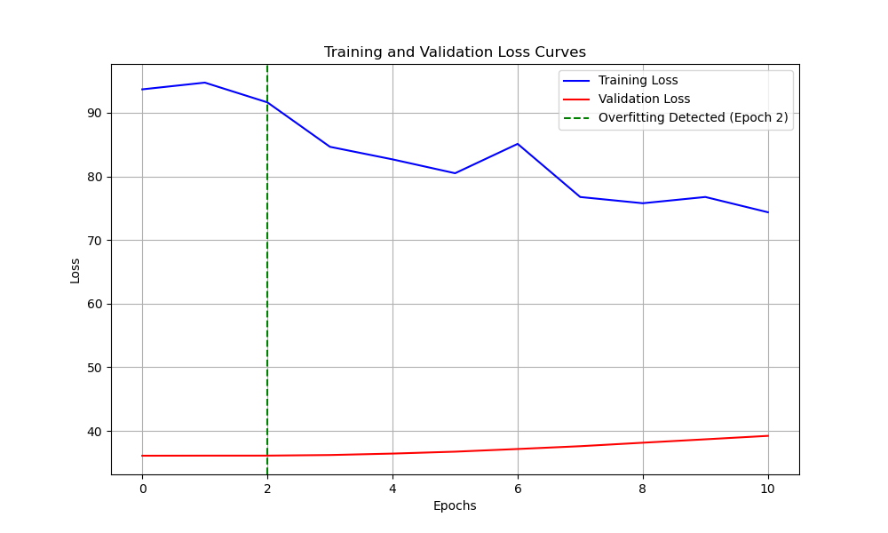
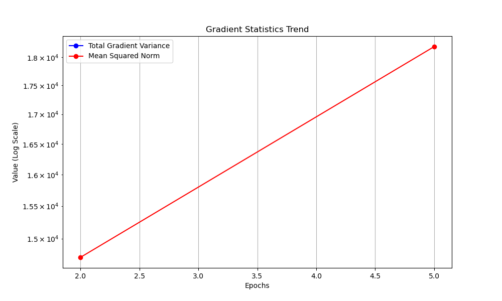

# Audio Classification Model Analysis Report

## 1. Experiment Overview

- **Experiment Name:** audio_fcnn_regression
- **Model Type:** fcnn
- **Data Type:** audio
- **Task Type:** regression

## 2. Model Structure Analysis

- **Total Parameters:** 690945
- **Layer Count:** 0
- **Layers with Most Parameters:**

## 3. Training History Analysis

- **Epochs Trained:** 11
- **Training Time:** 40.28968334197998 seconds
- **Final Training Loss:** 74.35979461669922
- **Final Validation Loss:** 39.23031997680664
- **Best Validation Loss:** 36.11079406738281
- **Convergence Speed:** 3.7081407819475447 (average loss decrease per epoch)
- **Train-Validation Difference:** 46.17527181451971 (average difference)
- **Convergence Status:** Underfitting (Training loss higher than validation loss)
- **Overfitting Detected:** Yes (Epoch 2)

## 4. GNS (Gradient Noise Scale) Analysis

- **Epochs Analyzed:** 2, 5
- **Average GNS Value:** 0.0
- **GNS Trend:** Stable
- **Current Batch Size:** 16
- **Recommended Batch Size:** 8
- **Recommendation:** Low GNS value detected. Consider decreasing batch size for faster convergence.

## 5. Conclusions and Recommendations

- **Model Complexity:** The model parameter count is moderate.
- **Training Process:** Overfitting detected. Consider adding regularization (e.g., Dropout, L2 regularization) or implementing early stopping.
- **Batch Size:** Low GNS value detected. Consider decreasing batch size for faster convergence.
