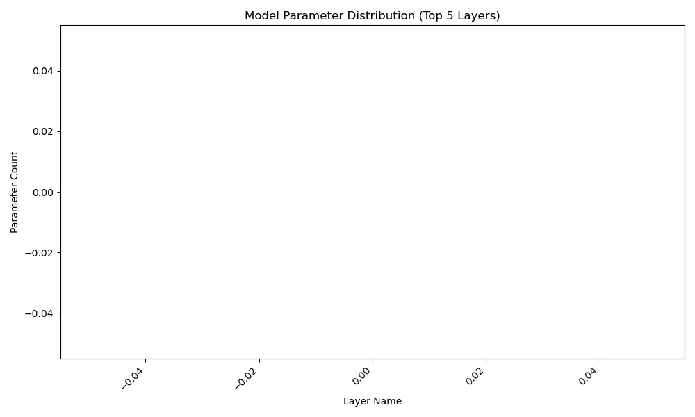
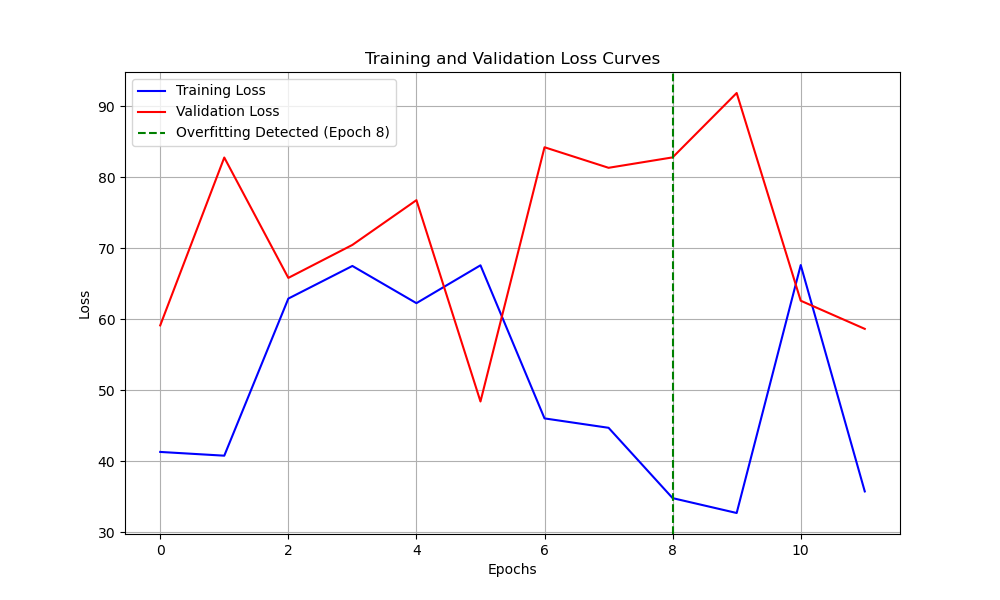
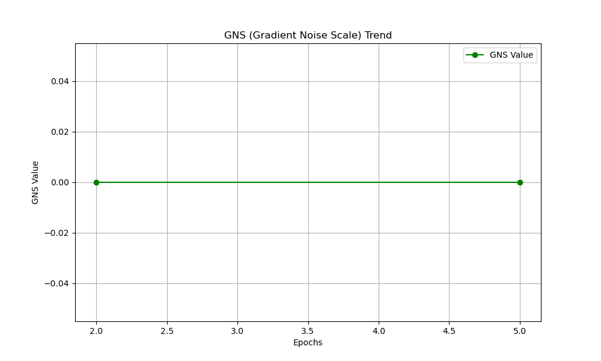
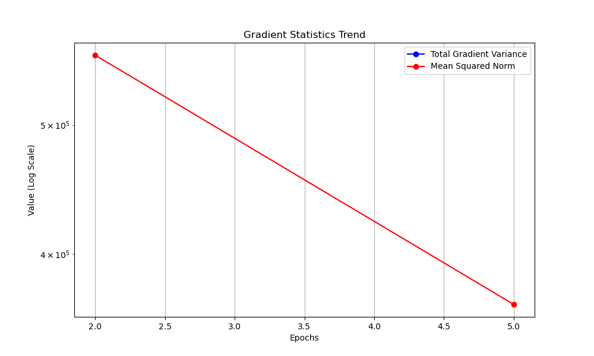

# Audio Classification Model Analysis Report

## 1. Experiment Overview

- **Experiment Name:** audio_swin_classification
- **Model Type:** swin_transformer
- **Data Type:** audio
- **Task Type:** classification

## 2. Model Structure Analysis

- **Total Parameters:** 27626766
- **Layer Count:** 0
- **Layers with Most Parameters:**

## 3. Training History Analysis

- **Epochs Trained:** 12
- **Training Time:** 87.22824120521545 seconds
- **Final Training Loss:** 35.75230026245117
- **Final Validation Loss:** 58.63797378540039
- **Best Validation Loss:** 48.41275405883789
- **Convergence Speed:** 10.357656751360212 (average loss decrease per epoch)
- **Train-Validation Difference:** 25.760514895121258 (average difference)
- **Convergence Status:** Moderate
- **Overfitting Detected:** Yes (Epoch 8)

## 4. GNS (Gradient Noise Scale) Analysis

- **Epochs Analyzed:** 2, 5
- **Average GNS Value:** 0.0
- **GNS Trend:** Stable
- **Current Batch Size:** 16
- **Recommended Batch Size:** 8
- **Recommendation:** Low GNS value detected. Consider decreasing batch size for faster convergence.

## 5. Conclusions and Recommendations

- **Model Complexity:** The model has a large number of parameters. Consider using a smaller model or pruning techniques to reduce parameter count.
- **Training Process:** Overfitting detected. Consider adding regularization (e.g., Dropout, L2 regularization) or implementing early stopping.
- **Batch Size:** Low GNS value detected. Consider decreasing batch size for faster convergence.
