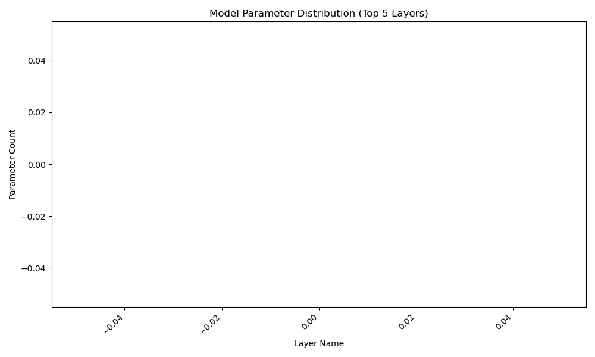
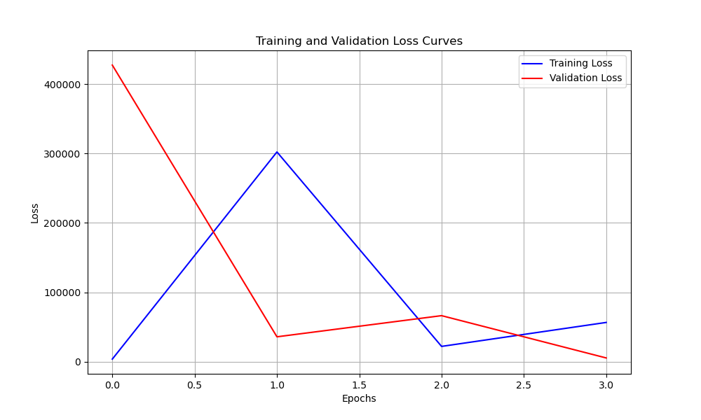

# Audio Classification Model Analysis Report

## 1. Experiment Overview

- **Experiment Name:** audio_swin_regression
- **Model Type:** swin_transformer
- **Data Type:** audio
- **Task Type:** regression

## 2. Model Structure Analysis

- **Total Parameters:** 27618684
- **Layer Count:** 0
- **Layers with Most Parameters:**

## 3. Training History Analysis

- **Epochs Trained:** 4
- **Training Time:** 14.943958044052124 seconds
- **Final Training Loss:** 56527.22265625
- **Final Validation Loss:** 5339.5859375
- **Best Validation Loss:** 5339.5859375
- **Convergence Speed:** 280261.193359375 (average loss decrease per epoch)
- **Train-Validation Difference:** 196426.8617553711 (average difference)
- **Convergence Status:** Underfitting (Training loss higher than validation loss)
- **Overfitting Detected:** No

## 5. Conclusions and Recommendations

- **Model Complexity:** The model has a large number of parameters. Consider using a smaller model or pruning techniques to reduce parameter count.
- **Training Process:** Underfitting detected. Consider increasing model capacity or extending training duration.
