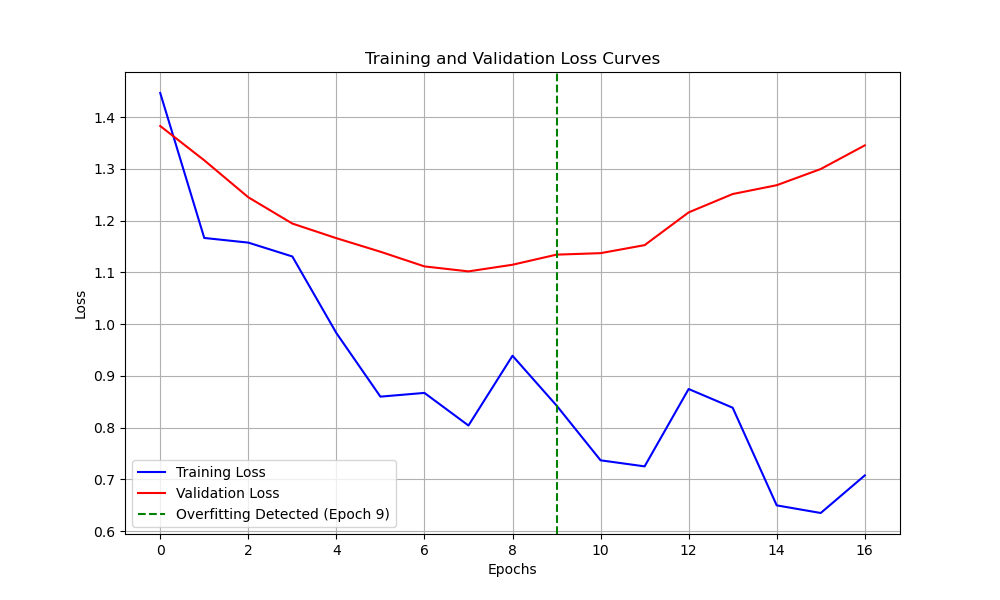
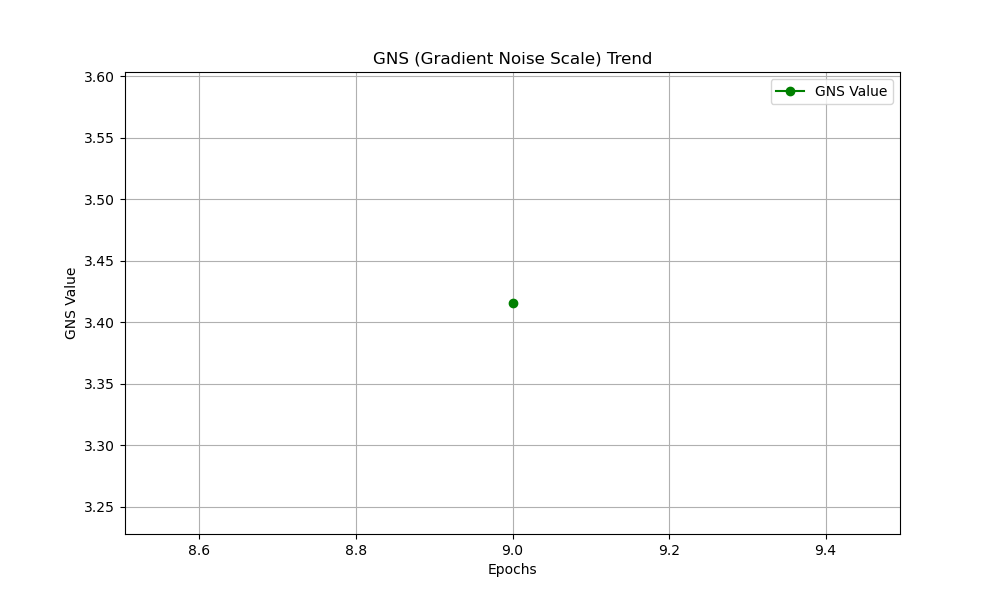
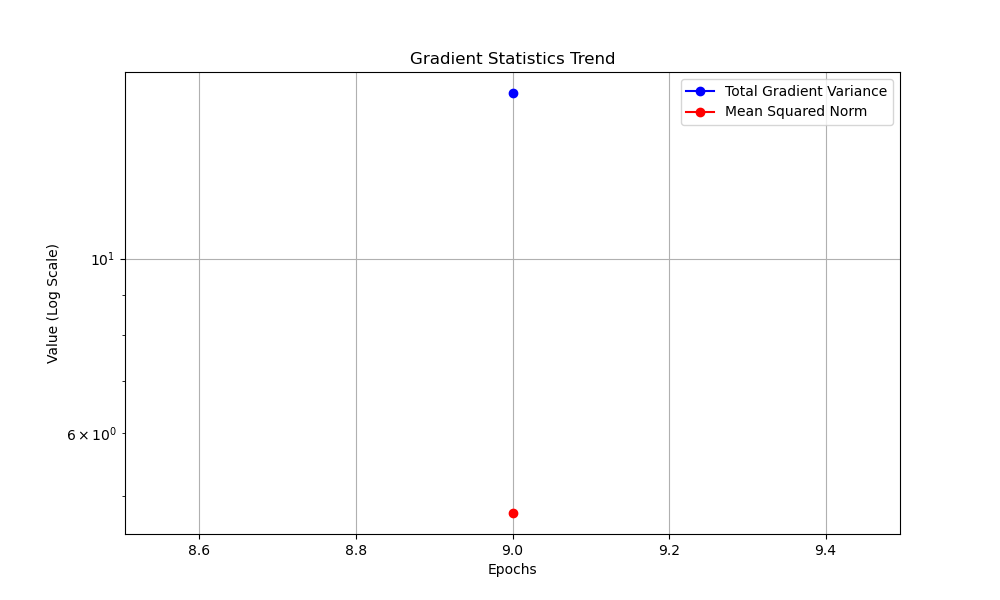

# Audio Classification Model Analysis Report

## 1. Experiment Overview

- **Experiment Name:** custom_audio_fcnn_classification
- **Model Type:** fcnn
- **Data Type:** audio
- **Task Type:** classification

## 2. Model Structure Analysis

- **Total Parameters:** 232580
- **Layer Count:** 0
- **Layers with Most Parameters:**

## 3. Training History Analysis

- **Epochs Trained:** 17
- **Training Time:** 25.43625259399414 seconds
- **Final Training Loss:** 0.7075666785240173
- **Final Validation Loss:** 1.3455708026885986
- **Best Validation Loss:** 1.1020151376724243
- **Convergence Speed:** 0.0919596217572689 (average loss decrease per epoch)
- **Train-Validation Difference:** 0.3142865094191888 (average difference)
- **Convergence Status:** Moderate
- **Overfitting Detected:** Yes (Epoch 9)

## 4. GNS (Gradient Noise Scale) Analysis

- **Epochs Analyzed:** 9
- **Average GNS Value:** 3.41560334979544
- **GNS Trend:** Stable
- **Current Batch Size:** 16
- **Recommended Batch Size:** 16
- **Recommendation:** GNS value is moderate. Current batch size appears appropriate.

## 5. Conclusions and Recommendations

- **Model Complexity:** The model parameter count is moderate.
- **Training Process:** Overfitting detected. Consider adding regularization (e.g., Dropout, L2 regularization) or implementing early stopping.
- **Batch Size:** GNS value is moderate. Current batch size appears appropriate.
